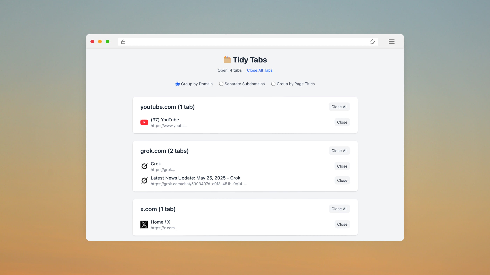

# 🗂️ Tidy Tabs

**Tidy Tabs** is a Chrome extension that helps you organize and manage your open tabs by grouping them based on **domain**, **subdomain**, or **page title** — and gives you the power to close tabs individually, by group, or all at once.

Every time you open a new tab (`⌘+T` or `Ctrl+T`), **Tidy Tabs** automatically displays a smart overview of all your open tabs — letting you quickly review, group, and close them to keep your browser clutter-free.



Built with [Solid.js](https://solidjs.com), [TailwindCSS](https://tailwindcss.com), and [Vite](https://vitejs.dev).

---

## 🚀 Features

- ✅ Group tabs by domain, subdomain, or page title  
- ✅ Close individual tabs or entire groups with one click  
- ✅ Clean, fast, and responsive UI (with dark mode support)  
- ✅ Shows total number of open tabs  
- ✅ Easy-to-use Chrome Extension with custom new tab override

---

## 📦 Installation

1. Clone the repo:

   ```bash
   git clone https://github.com/sudheer-salavadi/tidy-tabs.git
   cd tidy-tabs
   ```

2. Install dependencies:

   ```bash
   npm install
   ```

3. Build the extension:

   ```bash
   npm run build
   ```

4. Load it in Chrome:
   - Go to `chrome://extensions`
   - Enable **Developer mode**
   - Click **"Load unpacked"**
   - Select the `dist/` folder

---

## 🔧 Scripts

```bash
npm run dev     # Start development server at http://localhost:5173
npm run build   # Build extension to dist/
npm run preview # Preview production build
```

---

## 🌐 Tech Stack

- **Framework:** [Solid.js](https://solidjs.com)
- **Styling:** [TailwindCSS](https://tailwindcss.com)
- **Bundler:** [Vite](https://vitejs.dev)

---

## 📁 Folder Structure

```
tidy-tabs/
├── public/           # manifest.json and icons
├── src/              # Solid components and styles
├── dist/             # Final build output
├── vite.config.js    # Build config with copy plugin for icons
└── package.json
```

---

## 📜 License

MIT License

Copyright (c) 2024 Sudheer Salavadi

Permission is hereby granted, free of charge, to any person obtaining a copy
of this software and associated documentation files (the “Software”), to deal
in the Software without restriction, including without limitation the rights
to use, copy, modify, merge, publish, distribute, sublicense, and/or sell
copies of the Software, and to permit persons to whom the Software is
furnished to do so, subject to the following conditions:

The above copyright notice and this permission notice shall be included in all
copies or substantial portions of the Software.

THE SOFTWARE IS PROVIDED “AS IS”, WITHOUT WARRANTY OF ANY KIND, EXPRESS OR
IMPLIED, INCLUDING BUT NOT LIMITED TO THE WARRANTIES OF MERCHANTABILITY,
FITNESS FOR A PARTICULAR PURPOSE AND NONINFRINGEMENT. IN NO EVENT SHALL THE
AUTHORS OR COPYRIGHT HOLDERS BE LIABLE FOR ANY CLAIM, DAMAGES OR OTHER
LIABILITY, WHETHER IN AN ACTION OF CONTRACT, TORT OR OTHERWISE, ARISING FROM,
OUT OF OR IN CONNECTION WITH THE SOFTWARE OR THE USE OR OTHER DEALINGS IN THE
SOFTWARE.

---

## 💡 Future Ideas

- Tab memory usage tracking
- Auto-clean tab groups by inactivity
- Keyboard shortcuts for tab actions

---

## 🙌 Contribute or Suggest

Pull requests, issues, and feature suggestions welcome!
